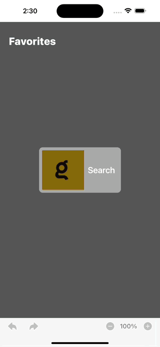
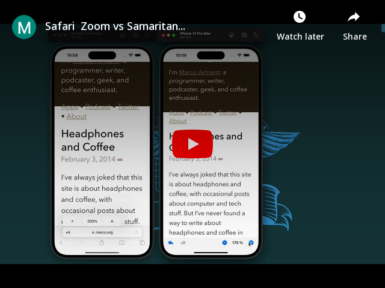
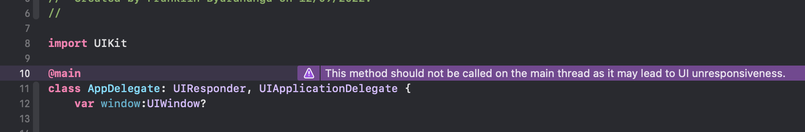

# Samaritan

## Overview

Samaritan Browser is a partial implementation of Safari functionality, which includes page navigation and page zoom features.
This branch was Compiled with Xcode 14.0.0, and Swift 5.7 and supports iOS 13 and above.
Project Documentation generate using **Apples DocC** can be accessed using this link (Documentation)

## Implementation Details

### Navigation Implementation

Navigation is implemented with both Buttons and Gestures. Both share the same function.
The navigation functions use WKWebView functions ([goForward](https://developer.apple.com/documentation/webkit/wkwebview/1414993-goforward) & [goBack](https://developer.apple.com/documentation/webkit/wkwebview/1414952-goback)) if those are not available like after State Restoration.
The navigation functions will switch and use navigation history persisted to disk.

#### Buttons

The state of back/forward buttons adapts accordingly to reflect an ability for the user to go either back or forward.

#### Gestures

The swipe gestures are a combination of both built-in WKWebView swipe gestures and gestures added to the starter view.
When the webview is not hidden & [webView.canGoBack](https://developer.apple.com/documentation/webkit/wkwebview/1414966-cangoback) is true then WKWebView swipe gestures are used.
If the starter view is active or [webView.canGoBack](https://developer.apple.com/documentation/webkit/wkwebview/1414966-cangoback) is false then swipe Gestures added to the starter view are used.  
Both the webview & startview gestures use slide-in transitions so users can seamlessly swipe between both views and they will act like one view.
using the same gestures.

|     Gestures Navigation     | Buttons Navigation                |
| :-------------------------: | :-------------------------------- |
|  |  |

### Persistence Implementation

The Apps Persistence is implemented using both UserDefaults and Realm

#### UserDefaults

UserDefaults is used to store the Zoom value to be restored for both App Restarts and App Relaunches.
UserDefaults was selected because zoom levels tend to be device-specific.
A user may use Zoom = 150% on an iPhone and Zoom = 85% on an iPad.

#### Realm

Realm is used to store the webview navigation history to be restored for App Relaunches.
History is generated from the [webView.backForwardList](https://developer.apple.com/documentation/webkit/wkwebview/1414977-backforwardlist) during the [encodeRestorableState(with:)](https://developer.apple.com/documentation/uikit/uiviewcontroller/1621461-encoderestorablestate)
The state restoration framework intentionally discards any state information when the user manually kills an app, or when the state restoration process fails.
These checks exist so that the app doesn’t get stuck in an infinite loop of bad states and restoration crashes.

|                              |                                                                        |
| :--------------------------: | :--------------------------------------------------------------------- |
|  | Demo showing restore of WKWebView navigation history during Relaunches |

### Zoom Implementation

The Apps Zoom is implemented using `webView?.setValue(pageZoom, forKey: "viewScale")` and and is restored in [webView(\_:didFinish:)](https://developer.apple.com/documentation/webkit/wknavigationdelegate/1455629-webview). Below is a video comparing Safari Zoom & Samaritan Zoom

#### Alternatives Considered

Here are a few alternative methods of zoom I tried out.

- pageZoom: using Instance Property [pageZoom](https://developer.apple.com/documentation/webkit/wkwebview/3516411-pagezoom). The main issue this is only available for iOS 14.0+
- webkitTextSizeAdjust & evaluateJavaScript: Zoom is possible but not similar to safari
- [setZoomScale](https://developer.apple.com/documentation/uikit/uiscrollview/1619412-setzoomscale) for the scrollView: Zoom is possible but not similar to safari

### Known issues

- **WKWebView & Xcode 14 Bug**
  You get the following warning if you are using WKWebView. The warning doesn't appear in Xcode 13.4.1
  warning run: This method should not be called on the main thread as it may lead to UI unresponsiveness.

  

  Various Forums also reporting the same issue are listed below. At the moment there is no fix we just have to wait for Apple to Squash this Bug.
  I have submitted a bug report to Apple

  - https://developer.apple.com/forums/thread/712074
  - https://github.com/OneSignal/OneSignal-iOS-SDK/issues/1113
  - https://groups.google.com/g/google-admob-ads-sdk/c/QQLDBQlO340
