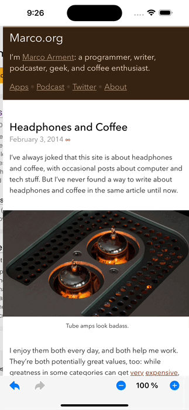

# Samaritan

[](https://opensource.org/licenses/MPL-2.0)

[](https://developer.apple.com/swift)
[](http://makeapullrequest.com)
[](http://twitter.com/byaruhaf)

## Overview

Samaritan Browser, is an partial implementation of Safari functionality, which includes pages navigation and pages zoom features.
This branch was Compiled with Xcode 14.0.0, Swift 5.7 and supports iOS 13 and above.
Project Documentation generate using **Apples DocC** can be accessed using this link (Documentation)

## Implementation Details

### Navigation Implementation

Navigation is implemented with both Buttons and Gestures. Both sharing the same function.
The navigation functions use WKWebView functions (goForward & goBack) if those are not available like after State Restoration.
The navigation functions will switch and use navigation history persisted to disk.

#### Buttons

The state of back/forward Buttons adapt accordingly to reflect an ability for the user to go either back or forward.

#### Gestures

The swipe gestures are combination of both built in WKWebView swipe gestures and gestures added to the starter view.
When the webview is not hidden & webView.canGoBack is true then WKWebView swipe gestures are used.
If starter view is active or webView.canGoBack is false then swipe Gestures added to the starter view are used.  
Both the webview & startview gestures use a slide in transitions so users can seamlessly swipe between both views and they will act like one view.
using the same gestures.

|     Gestures Navigation     | Buttons Navigation                |
| :-------------------------: | :-------------------------------- |
|  |  |

### Restore WKWebView navigation history

### Persistence Implementation

#### UserDefaults

#### Realm

### Zoom Implementation

[](https://youtu.be/nOsr5MuHJPg "Safari Zoom vs Samaritan Zoom")

#### Alternatives Considered

#### pageZoom

using Instance Property pageZoom. The scale factor by which the web view scales content relative to its bounds.
issue: only available for iOS 14.0+
`webView.pageZoom`

#### webkitTextSizeAdjust

issue: similar to safari but not Right.

```js
let js = "document.getElementsByTagName('body')[0].style.webkitTextSizeAdjust='\(zoomlevel)%'"
webView.evaluateJavaScript(js, completionHandler: nil)
```

#### setZoomScale for the scrollView

issue: similar to safari but not Right.

```swift
self.webView.scrollView.setZoomScale(currentZoom, animated: true)
```

### Known issues

- **WKWebView & Xcode 14 Bug**
  On Xcode 14 you get the following warning if you are using WKWebView. The warning doesn't appear in Xcode 13.4.1
  warning run: This method should not be called on the main thread as it may lead to UI unresponsiveness.

  

  Various Forums also reporting the same issue are listed below.

  - https://developer.apple.com/forums/thread/712074
  - https://developer.apple.com/forums/thread/714467
  - https://github.com/OneSignal/OneSignal-iOS-SDK/issues/1113
  - https://developer.apple.com/forums/thread/713290
  - https://groups.google.com/g/google-admob-ads-sdk/c/QQLDBQlO340

At the moment there is no fix we just have to wait for Apple to Squash this Bug.
